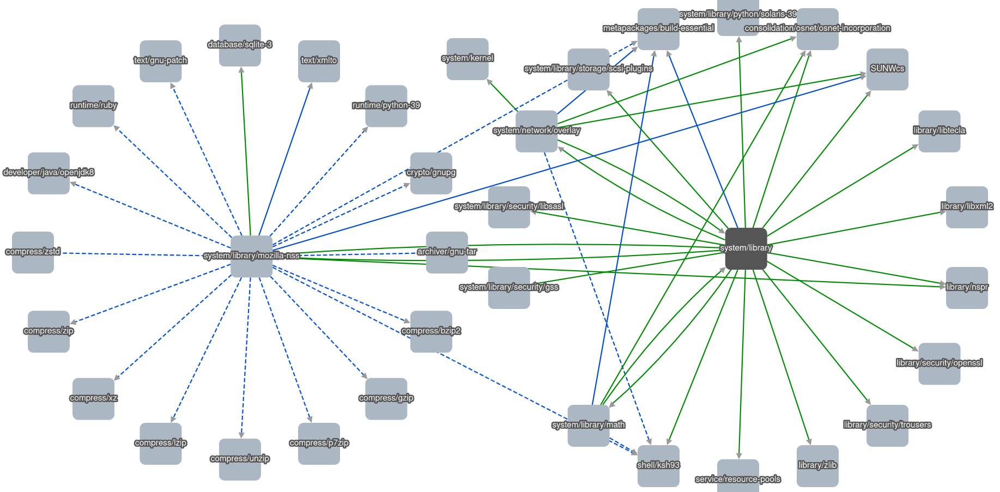

# oi-pkg-visualizer

Is website for visualizing dependencies between packages from OpenIndiana.

## How to

### Build

Just run `make`, it will download [cytoscape.js](https://github.com/cytoscape/cytoscape.js) and compile server.

### Use

- First of all, you need to run [oi-pkg-checker](https://github.com/aueam/oi-pkg-checker) to get `data.bin`.
- Run server with `target/release/oi-pkg-visualizer 127.0.0.1:2310 /tmp/data.bin`
    - `127.0.0.1:2310` is listening address and port of server
    - `/tmp/data.bin` is path to the data from the [oi-pkg-checker](https://github.com/aueam/oi-pkg-checker)
- Open `127.0.0.1:2310` in your browser

## Style legend

### Nodes

- default = green
- obsoleted = black
- obsoleted (but with older not obsoleted version) = yellow
- renamed = blue

### Edges

- default = green
- build = blue
- test = grey
- system-build = dashed blue
- system-test = dashed grey

## Version Compatibility

| oi-pkg-visualizer | oi-pkg-checker-core |
|:-----------------:|:-------------------:|
|   1.1.2 - 1.1.5   |        2.0.2        |
|       1.1.1       |        2.0.1        |
